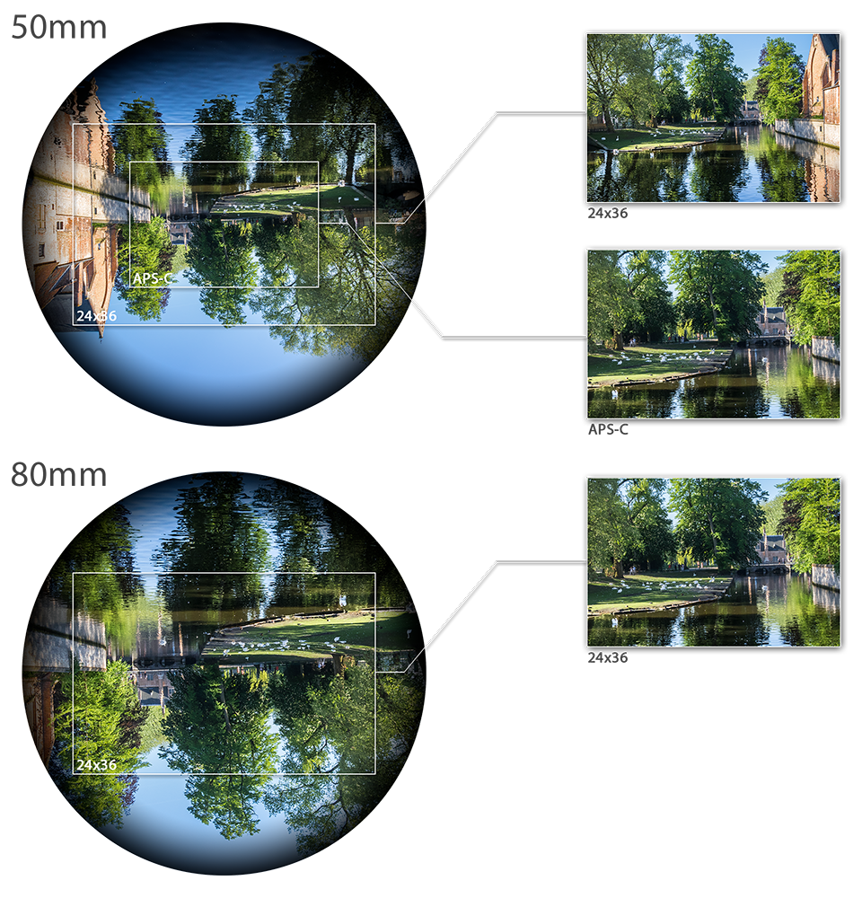

Title:      Formules en photographie
Date:       2018-05-05
Tags:       photographie mathématiques
Slug:       math-et-photo
Category:   Photo

## Focale

La « distance focale », ou tout simplement « focale » est une caractéristique intrinsèque de l'objectif, et dépend de l'agencement des lentilles dans celui-ci. Elle donne une indication sur la capacité de l'objectif à « rapprocher » le sujet.

Mathématiquement c'est la distance entre le capteur et le point nodal arrière de l'objectif lorsque celui-ci est mis au point à l'infini.

Les points nodaux de l'objectif sont les points $N$ et $N'$ de l'axe optique pour lesquels les angles d'inclinaison des rayons par rapport à l'axe sont identiques.

Si on définit $s_1$ comme la distance entre le sujet photographié et le point nodal avant $N$ et $s_2$ comme la distance entre le point nodal arrière $N'$ et le capteur, on a la relation :

$$ \frac{1}{s_1}+\frac{1}{s_2}=\frac{1}{f} $$

On a donc bien, pour une mise au point à l'infini ($s_1 \approx \infty$) : 

$$ \frac{1}{s_2}=\frac{1}{f} \quad\Rightarrow\quad f = s_2 $$

### Angle de champ

L'angle de champ $α$ est l'angle du cône ayant pour sommet le capteur et pour base la portion du paysage photographiée. Il est donné par la formule suivante, où $l$ est une des longueurs du capteur (longueur, largeur ou diagonale) et $f$ la focale :

$$ α = 2.\arctan\left(\frac{l}{2f}\right) $$

Il en découle que plus la focale est grande, plus la portion de paysage capturée est petite (téléobjectif) et, inversement, plus la focale est courte plus la portion capturée est grande (grand angle).

Une autre illustration de l'effet de l'angle de champ avec cette vidéo :

<video width="568" height="640" controls loop>
  <source src="/images/focal-vs-fov.mp4" type="video/mp4">
</video>

On distingue quatre phases distinctes :

  1. La focale est fixe, le photographe s'éloigne du sujet ;
  2. La focale est fixe, le photographe se rapproche du sujet ;
  3. Le photographe s'éloigne à nouveau du sujet en augmentant la focale pour que celui ci garde la même taille dans l'image ;
  4. Le photographe s'approche à nouveau, en diminuant la focale pour préserver la taille de l'image.

On notera à quel point l'aumentation de focale réduit l'angle de champ (on voit une plus petite portion du paysage d'arrière plan) mais également écrase les distances (l'arrière plan à l'air beaucoup plus proche du premier plan).

### Cercle image et taille de capteur

Le cercle image est ni plus ni moins que l'image formée sur le plan focal par les rayons lumineux passant dans l'objectif. Comme ce dernier est circulaire, l'image formée est un cerle. L'image formée est inversée et légèrement plus sombre sur les bords. En principe, la zone du capteur est totalement inclue dans le cercle image. Si la zone du capteur est trop proche du bord du cercle image, il capture en partie la zone plus sombre du cercle image, c'est ce qu'on appelle le vignettage. Enfin pour certains objetifs très grand angle (fisheye), c'est un parti pris de faire en sorte que tout le capteur ne soit pas exposé, voire que le cercle image soit totalement inclus dans la zone du capteur.

#### Crop-factor

Pour un objectif donné le cercle image sera toujours le même. Ce qui peut changer, c'est la taille physique de la surface sensible (pellicule ou capteur), qui va déterminer quelle portion du cercle image constituera la photo finale.

Comme montré sur le schéma ci-dessous un capteur Full Frame (24mm x 36mm) prend une plus grande portion du cercle image qu'un capteur APS-C (14.9mm x 22.3mm). Le cadrage est donc différent, et pour avoir le même cadrage il faut une focale dont la taille est proportionnelle à la différence de taille des capteurs. Dans notre exemple :

$$ \frac{24}{14.9}=\frac{36}{22.3}\approx 1.6 $$

Pour obtenir le même cadrage avec un capteur full frame qu'avec un APS-C, il faut donc un objectif avec une focale 1.6 fois plus grande (dans l'exemple $50 \times 1.6 = 80$). C'est cette valeur qu'on appelle « crop-factor » et qui sert à calculer la « focal équivalente 24x36 », c'est-à-dire quelle focale on mettrait sur un appareil plein format pour obtenir le même cadrage qu'avec un autre couple taille de capteur/focale.

Ci-dessous quelques valeurs pour des tailles de capteur courantes :

Capteur     | Crop Factor
:-----------|:------------
24x36       | 1
APS-C       | 1.5
APS-C Canon | 1.6
μ4/3        | 2

## Ouverture

L'ouverture est le réglage permettant d'ajuster le diamètre d'ouverture du diaphragme de l'objectif. Elle est caractérisée par le nombre d'ouverture $N$, en général noté ƒ/$N$ qui représente le rapport entre la focale $f$ et le diamètre d'ouverture $d$ :

$$ N = \frac{f}{d} $$

Une confusion fréquente est faite concernant de diamètre d'ouverture. Il ne s'agit pas du diamètre physique du diphragme, mais du diamètre de la pupille d'entrée, c'est-à-dire du diamètre du diaphragme **vu à travers les lentilles se situant entre le sujet et le diaphragme**.

## Exposition

Stop, diaph, click, IL (indice de lumination), EV (exposure value), … tous ces termes désignent la même chose. Une « valeur d'exposition » qui indique la quantité de lumière reçue par le capteur. Celle-ci vaut 0 pour une ouverture de ƒ/1 et une exposition de 1s (à 100 ISO). La formule pour calculer cette valeur est donnée en fonction du nombre d'ouverture $N$ et de la durée d'exposition $t$ :

$$ EV = log_2\left(\frac{N^2}{t}\right) $$

Ce qui donne la table suivante pour les couples exposition/ouverture courants :

$t$   |ƒ/1|ƒ/1.4|ƒ/2|ƒ/2.8|ƒ/4|ƒ/5.6|ƒ/8|ƒ/11|ƒ/16|ƒ/22
------|---|-----|---|-----|---|-----|---|----|----|----
30    |-5 |-4   |-3 |-2   |-1 |0    |1  |2   |3   |4
15    |-4 |-3   |-2 |-1   |0  |1    |2  |3   |4   |5
8     |-3 |-2   |-1 |0    |1  |2    |3  |4   |5   |6
4     |-2 |-1   |0  |1    |2  |3    |4  |5   |6   |7
2     |-1 |0    |1  |2    |3  |4    |5  |6   |7   |8
1     |0  |1    |2  |3    |4  |5    |6  |7   |8   |9
0"5   |1  |2    |3  |4    |5  |6    |7  |8   |9   |10
1/4   |2  |3    |4  |5    |6  |7    |8  |9   |10  |11
1/8   |3  |4    |5  |6    |7  |8    |9  |10  |11  |12
1/15  |4  |5    |6  |7    |8  |9    |10 |11  |12  |13
1/30  |5  |6    |7  |8    |9  |10   |11 |12  |13  |14
1/60  |6  |7    |8  |9    |10 |11   |12 |13  |14  |15
1/125 |7  |8    |9  |10   |11 |12   |13 |14  |15  |16
1/250 |8  |9    |10 |11   |12 |13   |14 |15  |16  |17
1/500 |9  |10   |11 |12   |13 |14   |15 |16  |17  |18
1/1000|10 |11   |12 |13   |14 |15   |16 |17  |18  |19

C'est une gradeur relative, et le zéro est fixé par convention. Elle n'est en pratique jamais utilisée en tant que telle, mais pour comparer la différence de quantité de lumière recue avec deux réglages différents. Augmenter (ou diminuer) l'exposition de 1 EV correspond à un doublage (ou une divison par deux) de la quantité de lumière reçue. Cela veut donc dire que pour augmenter l'intensité lumineuse d'une EV, il est équivalent de :

  - Doubler le temps de pose ;
  - Doubler les ISOs ;
  - Diviser l'ouverture par 1.4.

La valeur de 1.4 pour l'ouverture est liée au fait que c'est la surface d'ouverture qui détermine la quantité de lumière reçue. Or la surface $S$ d'un disque est donnée en fonction de son rayon $r$ par la formule :

$$ S = πr^2 $$

et dans notre cas le rayon $r$ se calcule en fonction de la focale $f$ et de la valeur d'ouverture $N$ par la relation :

$$ 2r = \frac{f}{N} $$

ce qui donne :

$$ S = π\left(\frac{f}{2N}\right)^2 $$

Multiplier $S$ par deux, revient donc à diviser $N$ par $\sqrt{2}$ :

$$ 2S \;=\; 2π\left(\frac{f}{2N}\right)^2 
      \;=\; π\left(\sqrt{2}\frac{f}{2N}\right)^2
      \;=\; π\left(\frac{f}{2\frac{N}{\sqrt{2}}}\right)^2 $$

Attention les termes stop ou click peuvent être à l'origine de confusion lors de la manipulation de l'appareil. Bien souvent les boitiers permettent un réglage fin par pas de 1/2 ou 1/3 d'EV (selon les boitiers et leur paramétrage). Dans ce cas il ne faut pas confondre le click que fait la molette au moment du réglage (donc 1/2 ou 1/3 d'EV), et le click au sens exposition réelle (1 EV).

## Profondeur de champ

La profondeur de champ est la taille de la zone nette d'une image. Cette distance dépend de trois paramètres : la distance par rapport au sujet $d$, la focale de l'objectif $f$ et le nombre d'ouverture ƒ/$N$. Elle augmente avec la distance (plus le sujet est loin, plus la profondeur de champ est grande – les autres paramètres étant fixés), diminue avec la focale (plus vous zoommez, plus la profondeur de champ est courte) et diminue avec l'ouverture (plus vous ouvrez, donc plus le nombre d'ouverture – par exemple ƒ/2.8 – est petit, plus la profondeur de champ est courte).

### Cercle de confusion

Cette grandeur n'est pas utile en tant que telle pour le photographe. Je l'introduis ici, parce qu'elle est utilisée dans les paragraphes suivants.

Pour paraphraser [Wikipedia][coc], le cercle de confusion $c$ est le plus gros disque lumineux qui puisse se former sur le capteur et qui sera néanmoins perçu comme un point sur le tirage final. Caractérisé par son diamètre, il permet de déterminer la limite entre ce qui est perçu flou et ce qui est perçu net.

Globalement il dépend de la taille du capteur de l'appareil photo et de la taille du tirage final. En faisant des supositions sur cette dernière (rapport taille du tirage, distance de visionnage), on peut estimer les valeurs suivantes :

Capteur     | $c$
:-----------|:------
24x36       | 0.029
APS-C       | 0.019
APS-C Canon | 0.018
μ4/3        | 0.015

### Hyperfocale

La distance hyperfocale $H$ est la distance de mise au point la plus courte pour laquelle l'image est nette jusqu'à l'infini. Elle dépend de trois paramètres : la focale $f$, l'ouverture $N$ et la taille du cercle de confusion $c$. La formule est la suivante :

$$ H = f + \frac{f^2}{N.c} \approx \frac{f^2}{N.c} $$

### Calcul de la profondeur de champ

La profondeur de champ $DoF$ est la taille de la zone nette, donc la différence entre le point net le plus éloigné $D_{F}$, et le point net le plus proche $D_{N}$ :

$$ DoF = D_{F}-D_{N}$$

avec :

$$ D_{N} = \frac{H.s}{H+(s-f)} $$
$$ D_{F} = \frac{H.s}{H-(s-f)} $$

J'ai d'ailleurs créé un [petit calculateur][dof] pour se simplifier la vie.

## Autour de la macro

### Grandissement

Le grandissement (parfois appelé grossisement) $γ$ est le rapport entre la taille $t_i$ de l'image du sujet sur le capteur et la taille réelle $t_o$ du sujet.

$$ γ=\frac{t_i}{t_o} $$

Il peut être exprimé en fonction de la distance de mise au point $s$ et de la focale $f$ par la relation (et sa conjuguée) :

$$ γ=\frac{f}{s-f} \quad \Leftrightarrow \quad s=\frac{γ+1}{γ}f $$

Il est d'usage de parler de macrophotographie quand le grandissement est d'au moins 1 et de proxy pour les rapports compris entre 1 et 1/10.

### Bague allonge

Pour faire de la macro, on peut utiliser un objectif dédié (qui permet de se rapprocher du sujet), ou utiliser un tube allonge avec un objectif standard.

Si un objectif a un grandissement de $γ$ et une focale de $f$, alors une bague allonge de $x$ donnera un grandissement $γ'$ :

$$ γ'=γ+\frac{x}{f} $$

Si $s_0$ et $s_\infty$ sont respectivement les distances minimum et maximum de mise au point de l'objectif de base de focale $f$, alors, avec un tube allonge d'une longueur $x$, les nouvelles distances $s_0'$ et $s_\infty'$ sont données par :

<!-- $$ s_0' = \frac{(s_0-x)f^2 + xs_0f}{f^2 - xf + xs_0} $$ -->
$$ s_0' = f\frac{(1+γ')^2}{γ'} $$

$$ s_\infty' = f\left(1 + \frac{f}{x}\right) $$

### Bonnettte

La bonnette est une lentille qui se fixe au bout de l'objectif et qui agit comme une loupe. Sa puissance s'exprime en dioptries, qui est l'inverse de sa distance focale exprimée en mètres.

La bonnette à pour effet de faire perdre la mise au point à l'infini. La nouvelle distance de mise au point max $s_\infty'$ ne dépend que de la puissance $D$ de la bonnette et vaut :

$$ s_\infty' = \frac{1}{D} $$

La nouvelle distance minimum de mise au point $s_0'$ dépend quant à elle de la distance minimum de l'objectif nu $s_0$. La relation (et sa conjugée) est :

$$ s_0' = \frac{s_0}{Ds_0+1}  \quad \Leftrightarrow \quad  s_0 = \frac{s_0'}{1-Ds_0'} $$

Les grandissement à distance de mise au poin maximum $γ_\infty'$ et à distance minimum $γ_0'$

$$ γ_\infty' = fD $$

$$ γ_0' = γ_0(Ds_0+1) $$

  [coc]: https://fr.wikipedia.org/wiki/Cercle_de_confusion
  [dof]: https://photo.gregseth.net/dof

